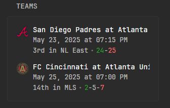

# Glance Sports Widget

This project is a Glance widget that displays upcoming games for major sports leagues. It fetches information from ESPN's unofficial API and supports the following leagues:

- MLB (Major League Baseball)
- MLS (Major League Soccer)
- NCAAF (NCAA Football)
- NHL (National Hockey League)
- NFL (National Football League)

## Features
- Shows upcoming games for supported leagues
- Data sourced from ESPN's unofficial API
- Simple and lightweight widget



## Glance Teams Widget Template

Below is the template used for the "Teams" widget in Glance:

```yaml
- type: custom-api
  title: "Teams"
  cache: 1h
  url: "http://glance-sports:3000/sports"
  template: |
    <ul class="list list-gap-10 collapsible-container" data-collapse-after="5">
    {{ range .JSON.Array "results" }}
      <li style="display: flex; align-items: flex-start;" class="text-truncate">
        
        <div>
          <p class="size-h4 color-highlight block text-truncate" style="margin: 0;">{{ .String "name" }}</p>
          <ul class="list-horizontal-text" style="margin: 0;">
            <li>{{ .String "date" }}</li>
          </ul>
          <ul class="list-horizontal-text">
            <li>{{ .String "standingSummary" }}</li>
            <li><span class="color-positive">{{ .String "wins" }}</span>{{ if .String "ties" }}-<span class="color-neutral">{{ .String "ties" }}</span>{{ end }}-<span class="color-negative">{{ .String "losses" }}</span></li>
          </ul>
        </div>
      </li>
    {{ end }}
    </ul>
```

## Getting Started

1. **Install dependencies:**
   ```bash
   npm install
   ```
2. **Run the app:**
   ```bash
   node app.js
   ```

## Running with Docker

You can run this app in a Docker container. To do so, build the image and run the container, mounting your `config.json` file into the container at `/usr/src/app/config.json`:

```bash
# Build the Docker image
docker build -t glance-sports .

# Run the container, mounting your config.json
# (replace /path/to/your/config.json with the actual path)
docker run -p 3000:3000 -v /path/to/your/config.json:/usr/src/app/config.json glance-sports
```

This ensures your configuration is used inside the container.

## Configuration
- Edit `config.json` to set up league preferences or other settings as needed.

## Folder Structure
- `app.js` - Main application entry point
- `config.json` - Configuration file

## Notes
- This project is not affiliated with or endorsed by ESPN.
- Use of ESPN's unofficial API is subject to change and may break functionality.

## License
MIT License

